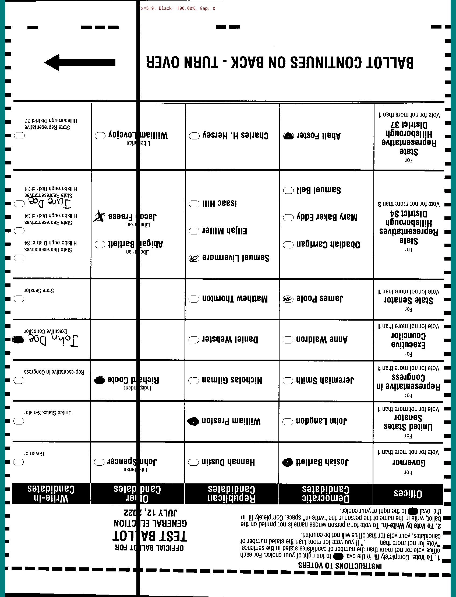
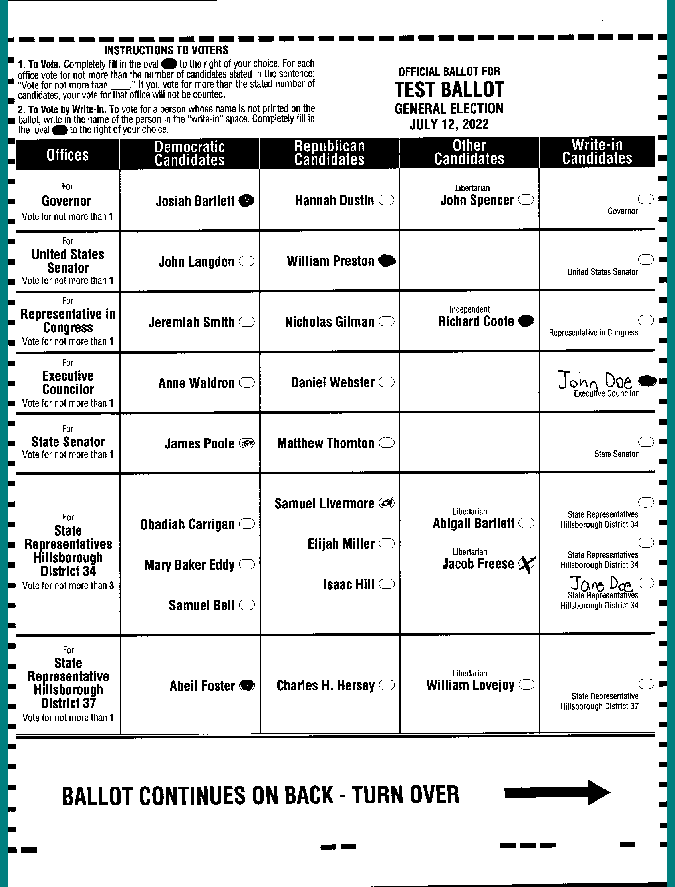

# Ballot Interpretation

Ballot interpretation begins with an image of the ballot transmitted from the scanner. Once the image is available to the application, it starts by trying to interpreting the ballot as a [hand marked ballot](hand-marked-ballots.md).

Before trying to make sense of the ballot, the interpreter checks the image for vertical streaks. Vertical streaks likely indicate some sort of smudge or debris in the scanner that could interfere with the ballot image. The interpreter looks for columns of black without gaps, excluding the edges of the ballot which may be black simply from the way the scanner creates images.

<figure><figcaption>
Vertical streak detected
</figcaption></figure>

 

<figure><figcaption>
No vertical streak detected
</figcaption></figure>

If a streak is detected, the interpreter exits and surfacse the error to the application which will alert the user.

The interpreter then identifies the timing mark grid. It begins by finding all shapes in the image. It then narrows the list of shapes down to ones that look like timing marks and then further narrows the list down to timing mark shapes that fall along the edges of the image in a line.

<figure><figcaption>
All shapes
</figcaption></figure>

 

<figure><figcaption>
Timing mark shapes
</figcaption></figure>

 

<figure><figcaption>
Timing mark shapes along edges
</figcaption></figure>

As in the example above, the interpreter might not have found all timing marks at this point. It infers any missing timing marks and identifies the corners in order to construct a complete timing mark grid. If at any point the interpreter does not have enough information to comfortably find the complete mark grid or if the detected grid is too rotated or skewed, it exits which causes the application to reject the ballot.

<figure><figcaption>
Identified corners
</figcaption></figure>

 

<figure><figcaption>
Identified timing marks
</figcaption></figure>

 

<figure><figcaption>
Timing mark grid
</figcaption></figure>

Next the interpreter will search the bottom left and top right corners of the image for a QR code.&#x20;

* search for QR code
* normalize orientation
* check mismatches on front and back
* score bubbles
* build interpreted page layout
* score write in areas

* attempt BMD interpretation - search for QR code in entire sheet
* save sheet
