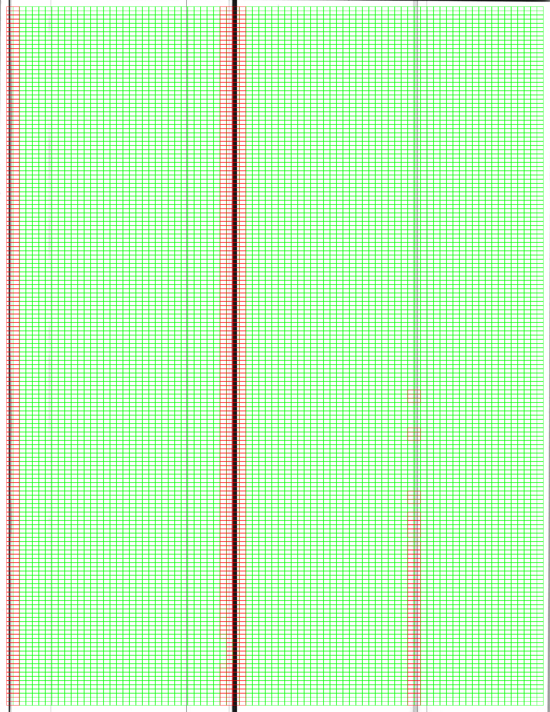

# Diagnostic Functions

All VxSuite components have a diagnostics interface accessible to system administrators and election managers that allows a user to monitor or test key components. Diagnostic information is shown to the user and can be exported as a PDF readiness report.

When a test is performed, the system logs the result and creates a diagnostic record which includes the outcome of the diagnostic, pass or fail. The outcome and date of the most recent diagnostic is displayed on the readiness report. One possible use case of the readiness report is to run all diagnostics before an election and then produce a readiness report that confirms all tests passed.&#x20;

## Common Diagnostics

### Storage

Retrieves the current amount of disk space used and disk space available for the application. The displayed total disk space will not be as large as the actual disk because some space is reserved for the system. The disk space usage will not always return to 0% after clearing election data because the database may not have liberate that disk space back to the operating system, but the space will be reused once more election data is loaded.

### Battery

For components with internal batteries - VxAdmin and VxCentralScan - the operating system is polled for battery status. The application will report the current charge level and whether or not the battery is currently charging.

### Configuration

#### Election Identifier

If there is an election configured on the machine, it will display the election title and hash.

#### Ballot Styles

For precinct equipment, the list of ballot styles will include only those appropriate for the current precinct configuration. For central equipment, the list of ballot styles will be all ballot styles in the election. The languages for each ballot style are also enumerated

#### Precinct

For precinct equipment - VxScan and VxMark -  the currently configured precinct will be shown, if any.

#### Mark Thresholds

For scanners - VxScan and VxCentralScan - the currently configured mark and write-in area thresholds will be shown. The thresholds reflect what was set in the [system settings](election-package/#system-settings).

## VxAdmin Diagnostics

### Printer

The toner level and any alerts from the printer are displayed, such as sleep mode, paper jams, or hardware malfunctions. There is an option to perform a test print, which will send a mock report to the printer. The user inspects the printed document and confirms whether the test print was successful or failed.

## VxCentralScan Diagnostics

### Batch Scanner

The user may perform a test scan, which requires that a blank white sheet of paper be scanned. The scanned image is broken up into small cells and each cell is checked for the percent of black pixels after binarization. If that percent is more than slightly over 0%, that cell is flagged and the entire diagnostic fails. The goal of the diagnostic is catch any defects in the scanned images, such as streaking produced by a dirty scanner.

<figure><figcaption>
Passed
</figcaption></figure>

 

<figure><figcaption>
Failed
</figcaption></figure>

