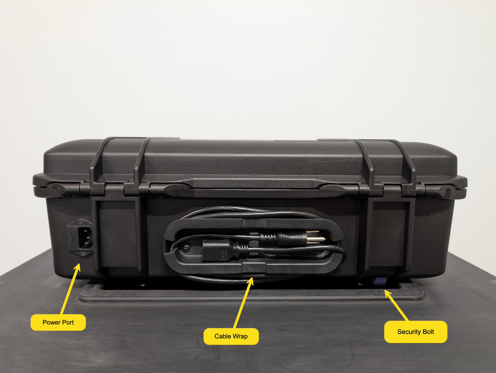

# VxScan Hardware

## Functional Overview

VxScan consists of two main components - the collapsible ballot box and the scanner itself - which are secured together during setup.

<figure><figcaption></figcaption></figure>

### Ballot Box

<figure><figcaption>
Ballot box front, collapsed
</figcaption></figure>

 

<figure><figcaption>
Ballot box side, collapsed
</figcaption></figure>

 

<figure><figcaption>
Ballot box lid underside, collapsed
</figcaption></figure>

The ballot box features a telescoping handle and wheels for ease of transport. When collapsed, closing straps run around the side of the box to hold it closed. Before the ballot box is set up, the closing straps are loosened and secured to the underside of the ballot box lid. &#x20;

The front of the ballot box is the ballot door, which is used to access the bin interior and any ballots within. It's opened by pulling the ballot door latch pictured above, which automatically latches whenever the door is closed. A seal can be installed to prevent the door from being opened without tamper-evidence.

The ballot door has a built-in auxiliary bin for depositing ballots in situations where the cannot be scanned. It can be in one of three states: closed, open slightly for depositing ballots, or open fully for removing ballots. It's opened by pressing down on the indicated handle which can be sealed with the adjacent seal point.

After closing straps are loosened, the ballot box can be expanded. An accented foot hook can be used as an aid in expanding the box. Once the box is fully expanded, the lid can be rotated up and over to eventually latch into place.

<figure><figcaption>
Ballot box side, open
</figcaption></figure>

 

<figure><figcaption>
Ballot box interior
</figcaption></figure>

 

<figure><figcaption>
Ballot box side, closed
</figcaption></figure>

The ballot box lid can be released by pushing the ballot box lid handle, indicated below. The handle is covered by the scanner when installed, so it cannot be opened while the scanner is in operation and sealed in place. The box lid has a ballot slot which mates with the scanner's ballot outfeed.&#x20;

The scanner attaches to the ballot box by sliding into the area in the front of the lid. Flanges on the bottom of the scanner prevent it from moving up and down or side to side. To secure the scanner front to back and lock it into place, the scanner has a security bolt which mates with the security bolt hole on the top of the ballot box. After the security bolt is engaged, the scanner cannot be removed until the security bolt is unsealed and released.

<figure><figcaption>
Ballot box from above, closed
</figcaption></figure>

### Scanner

The scanner is built into a customized Pelican 1485 Air case. The COTS case features:

* Seal Points
* Carrying Handle
* Spring-Loaded Latches

Additional cuts are made into the case for the back power port, the back cable wrap, the security bolt exit, nameplate attachment, and mounting features within the case.

<figure><figcaption>
Ballot box with scanner installed
</figcaption></figure>

 

<figure><figcaption>
Scanner rear
</figcaption></figure>

The case is opened by pressing the button on the case latch and lifting the lid. The elements that a voter or poll worker interact with are generally accented in purple, just as with the ballot box. In the picture below you can see the smart card insert, security bolt, ballot infeed, and printer outfeed all accented in purple.

<figure><figcaption>
Scanner main bottom tub
</figcaption></figure>

 

<figure><figcaption>
Scanner upper tub 
</figcaption></figure>

Then the scanner is first installed on the ballot box, the security bolt will be disengaged. While the security bolt is disengaged, the smart card slot will be blocked. The user must push the bolt down to lock the scanner into place on the ballot box and unblock the smart card slot. When the scanner must be removed from the ballot box, the user pulls the security bolt release to disengage the security bolt. In order to access the security bolt release, the poll worker door must be opened, which also reveals the scanner's USB ports. The poll worker door can be sealed shut by passing a seal through a cutout in the door and the hold in the top of the security bolt.

<figure><figcaption>
Poll worker door area
</figcaption></figure>

 

<figure><figcaption>
Poll worker door sealed
</figcaption></figure>

Poll workers will normally not have to interface with any parts of the scanner that have not already been described, but election managers will have to open the access door to perform maintenance on the printer and scanner. The access door is held in place by the poll worker door and can only be opened when the poll worker door is unsealed and opened. The printer and printer roll holder are beneath the access door toward the screen. The user presses the green release lever to remove the printer roll holder and install a paper roll. The scanner can be opened simply by lifting the scanner cover handle, revealing the scanner glass for easy cleaning.

<figure><figcaption>
Access door area
</figcaption></figure>

 

<figure><figcaption>
Scanner features
</figcaption></figure>

## COTS Components

