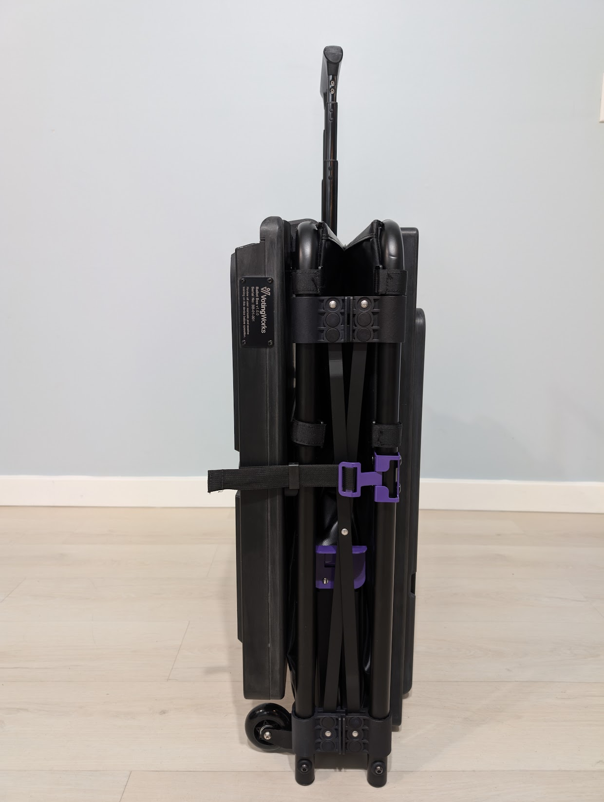
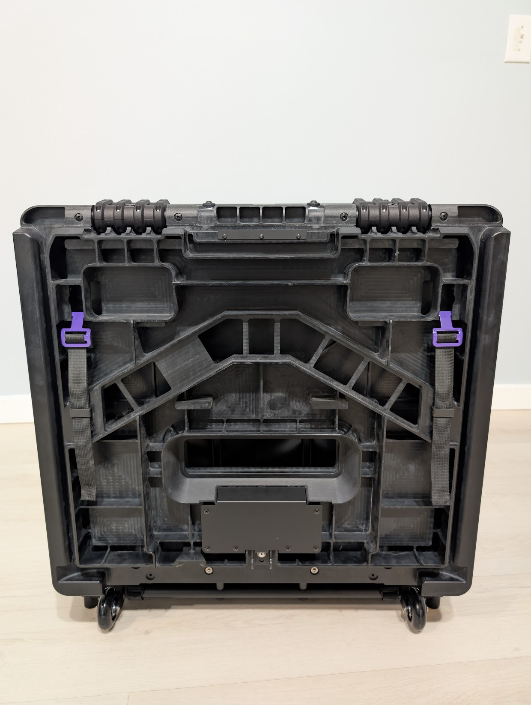

# VxScan Hardware

## Overview

VxScan consists of two main components - the collapsible ballot box and the scanner itself - which are put together during setup.

<figure><figcaption></figcaption></figure>

### Ballot Box

<figure><figcaption></figcaption></figure>

 

<figure><figcaption></figcaption></figure>

 

<figure><figcaption></figcaption></figure>

